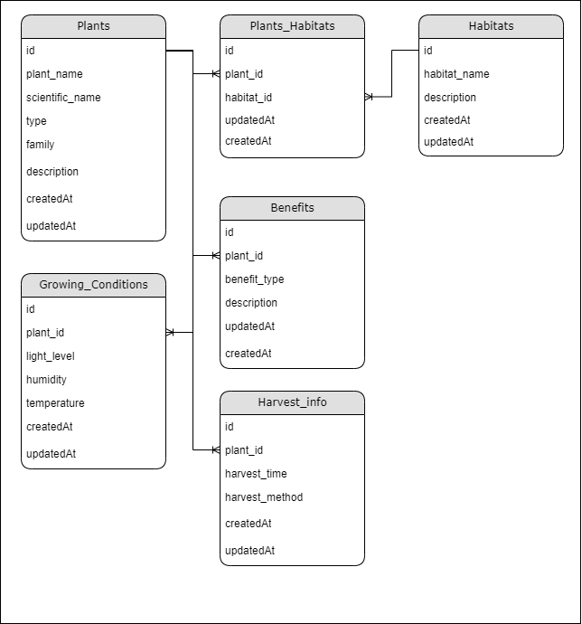

# Проектная работа по дисциплине «Базе данных».
## Этап 1: Разработка даталогической модели базы данных
#### Данная база данных предназначена для хранения информации о растениях, их экологических нишах, условиях выращивания, полезных свойствах и информации о сборе урожая. 

### Даталогическая модель базы данных.

### Таблицы и их описание:
1.	Plants: Хранит информацию о растениях, включая их название, научную классификацию, тип, семейство и описание.
2.	Habitats: Хранит информацию о различных экологических нишах, в которых могут расти растения.
3.	Plant_Habitats: Связывает растения с их экологическими нишами, позволяя указать дополнительные заметки.
4.	Growing_Conditions: Хранит условия выращивания растений, такие как уровень освещения, влажность и температура.
5.	Benefits: Хранит информацию о полезных свойствах растений.
6.	Harvest_Info: Хранит информацию о времени сбора урожая и методах сбора.

### Ограничения на таблицах:
- Plants: атрибут plant_name является уникальным и не может быть пустым.
- Habitats: атрибут habitat_name является уникальным и не может быть пустым.
- Plant_Habitats: связь с таблицами Plants и Habitats через внешние ключи.
- Growing_Conditions: атрибут temperature ограничен диапазоном от -50 до 50 градусов.
- Benefits и Harvest_Info: связь с таблицей Plants через внешние ключи с поддержкой каскадного удаления.

Также добавлены такие ограничения:

Атрибут light_level в таблице Growing_Conditions: должен быть одним из предопределенных значений:

```sql
ALTER TABLE Growing_Conditions ADD CONSTRAINT check_light_level CHECK (light_level IN ('низкая', 'средняя', 'высокая'));
```

Атрибут humidity в таблице Growing_Conditions должен быть одним из предопределенных значений:

```sql
ALTER TABLE Growing_Conditions ADD CONSTRAINT check_humidity CHECK (humidity IN ('низкая', 'средняя', 'высокая'));
```

### В таблице Plant_Habitats можно добавить поле total_plants, которое будет автоматически вычисляться с помощью триггера. Это поле будет показывать количество растений, связанных с конкретной экологической нишей.


## Этап 2: Создание базы данных в СУБД PostgreSQL. Заполнение таблиц данными. Составление осмысленных запросов к базе данных.

### Заполнение таблицы данными(код в приложении).

### 20 осмысленных запросов к базе данных(код в приложении).

- 1. Вывести все растения с их научными названиями и типами.
- 2. Найти все уникальные семейства растений.
- 3. Вывести все растения, которые относятся к семейству "Астровые".
- 4. Найти все растения, которые могут расти в окружающей среде "Пойма реки".
- 5. Вывести все растения, которые требуют среднюю освещенность.
- 6. Найти все растения, которые приносят пользу для здоровья, то есть лекарственные.
- 7. Вывести все растения, которые собираются летом.
- 8. Найти все растения, которые требуют температуру выше 15°C.
- 9. Найти все растения, у которых есть информация о сборе урожая осенью и росте в условиях средней влажности.
- 10. Найти все растения, которые могут расти в нескольких средах обитания.
- 11. Вывести все растения, которые были добавлены за последний месяц.
- 12. Найти все растения, которые требуют высокой влажности.
- 13. Вывести все растения, у которых есть информация о росте в условиях средней освещенности.
- 14. Вывести все растения, у которых есть информация о пользе для экологии и росте в условиях умеренной температуры (от 10°C до 20°C).
- 15. Найти все растения, которые могут расти в "Лесу" и имеют научные названия, начинающиеся на "A".
- 16. Вывести все растения, у которых есть информация о сборе урожая с помощью ножниц.
- 17. Вывести все растения с указанием их условий роста (освещение, влажность, температура).
- 18. Найти все растения, которые растут в "Садах" и имеют среднюю освещенность.
- 19. Вывести все растения с их научными названиями и временем сбора урожая, отсортированные по времени сбора.
- 20. Найти все растения, которые имеют более одного описания преимуществ.

## Этап 3: Добавление индесов в базу данных и обоснование их использования. Добавление триггера, придуманного на 1 этапе и добавление 5 процедур.

### Индекс для таблицы Plants
```sql
CREATE INDEX index_plants_plant_name ON Plants(plant_name);
```
Добавление индекса на plant_name обосновывается тем, что данное поле является уникальным и часто используется в запросах для поиска растений по их названию. Можно убедиться в этом, посмотрев на 20 осмысленных запросов в приложении.

### В таблице Habitats добавлено поле total_plants, которое будет автоматически вычисляться с помощью триггера. Это поле будет показывать количество растений, связанных с конкретной экологической нишей(код в приложении).
1. Добавление поля total_plants.
2. Создание функции для обновление поля total_plants.
3. Создание триггера для вызова функции.
4. Инициализирование поля total_plants.

### Добавление пяти процедур(код в приложении).

- 1. Процедура для добавления нового растения
- 2. Процедура для получения всех растений в определенном семействе
- 3. Процедура для обновления описания растения
- 4. Процедура для удаления растения и всех связанных данных
- 5. Процедура для получения всех растений, которые могут расти в определенном местообитании

## Приложение
### Заполнение таблицы Plants
```sql
INSERT INTO Plants (plant_name, scientific_name, type, family, description) VALUES
('Береза пушистая', 'Betula pendula', 'Дерево', 'Березовые', 'Быстрорастущее дерево с тонкой белой корой.'),
('Ель обыкновенная', 'Picea abies', 'Дерево', 'Сосновые', 'Вечнозеленое дерево с игольчатыми листьями.'),
('Клен остролистный', 'Acer platanoides', 'Дерево', 'Кленовые', 'Дерево с крупными листьями и яркой осенней окраской.'),
('Рябина обыкновенная', 'Sorbus aucuparia', 'Кустарник', 'Розовые', 'Кустарник или небольшое дерево с ягодами.'),
('Ива белая', 'Salix alba', 'Дерево', 'Ивовые', 'Быстрорастущее дерево, часто встречающееся у водоемов.'),
('Одуванчик лекарственный', 'Taraxacum officinale', 'Трава', 'Астровые', 'Многолетняя трава с желтыми цветками.'),
('Лопух большой', 'Arctium lappa', 'Трава', 'Астровые', 'Крупная трава с крупными листьями и колючими семенами.'),
('Калина обыкновенная', 'Viburnum opulus', 'Кустарник', 'Жимолостные', 'Кустарник с яркими красными ягодами.'),
('Осока волосистая', 'Carex pilosa', 'Трава', 'Осоковые', 'Многолетняя трава, распространенная в сырых местах.'),
('Дуб черешчатый', 'Quercus robur', 'Дерево', 'Буковые', 'Крупное дерево с плодами-желудями.'),
('Тысячелистник обыкновенный', 'Achillea millefolium', 'Трава', 'Астровые', 'Многолетняя трава с мелкими белыми цветками.'),
('Малина обыкновенная', 'Rubus idaeus', 'Кустарник', 'Розовые', 'Кустарник с ароматными ягодами.'),
('Черника обыкновенная', 'Vaccinium myrtillus', 'Кустарник', 'Вересковые', 'Кустарник с синими ягодами.'),
('Осина обыкновенная', 'Populus tremula', 'Дерево', 'Тополевая', 'Дерево с характерным шумом листьев.'),
('Лютик едкий', 'Ranunculus acris', 'Трава', 'Лютиковые', 'Многолетняя трава с яркими цветками.'),
('Черемуха обыкновенная', 'Prunus padus', 'Кустарник', 'Розовые', 'Кустарник с белыми цветками и черными ягодами.'),
('Земляника лесная', 'Fragaria vesca', 'Трава', 'Розовые', 'Многолетняя трава с красными ягодами.'),
('Вяз гладкий', 'Ulmus laevis', 'Дерево', 'Вязовые', 'Дерево с гладкой корой.'),
('Ольха серая', 'Alnus incana', 'Дерево', 'Берёзовые', 'Дерево с серой корой и мелкими цветками.'),
('Боярышник обыкновенный', 'Crataegus monogyna', 'Кустарник', 'Розовые', 'Кустарник с белыми цветками и ягодами.'),
('Смородина чёрная', 'Ribes nigrum', 'Кустарник', 'Розовые', 'Кустарник с черными ягодами.'),
('Щавель конский', 'Rumex acetosella', 'Трава', 'Щавелевые', 'Многолетняя трава с кислым вкусом.'),
('Липа серая', 'Tilia tomentosa', 'Дерево', 'Липовые', 'Дерево с крупными листьями и мелкими цветками.'),
('Колокольчик большой', 'Campanula latifolia', 'Трава', 'Колокольчиковые', 'Многолетняя трава с синими цветками.'),
('Бузина чёрная', 'Sambucus nigra', 'Кустарник', 'Адоксовые', 'Кустарник с черными ягодами.'),
('Кислица обыкновенная', 'Oxalis acetosella', 'Трава', 'Кисличные', 'Многолетняя трава с кислым вкусом.'),
('Вероника лекарственная', 'Veronica officinalis', 'Трава', 'Подорожниковые', 'Многолетняя трава с синими цветками.'),
('Голубика', 'Vaccinium corymbosum', 'Кустарник', 'Вересковые', 'Кустарник с синими ягодами.'),
('Яблоня лесная', 'Malus sylvestris', 'Дерево', 'Розовые', 'Дерево с плодами-яблоками.'),
('Горох', 'Pisum sativum', 'Трава', 'Бобовые', 'Зерновое растение, используемое в пищевой промышленности.'),
('Шпинат', 'Spinacia oleracea', 'Трава', 'Маревые', 'Зелень, богатая железом и витаминами.'),
('Руккола', 'Eruca vesicaria', 'Трава', 'Капустные', 'Зелень, используемая в салатах.'),
('Салат', 'Lactuca sativa', 'Трава', 'Астровые', 'Зелень, используемая в салатах.'),
('Укроп', 'Anethum graveolens', 'Трава', 'Зонтичные', 'Пряность, используемая в кулинарии.'),
('Петрушка', 'Petroselinum crispum', 'Трава', 'Зонтичные', 'Пряность, используемая в кулинарии.'),
('Кинза', 'Coriandrum sativum', 'Трава', 'Зонтичные', 'Пряность, используемая в кулинарии.'),
('Шалфей', 'Salvia officinalis', 'Трава', 'Яснотковые', 'Пряность, используемая в кулинарии.'),
('Мелисса', 'Melissa officinalis', 'Трава', 'Яснотковые', 'Травянистое растение, используемое в кулинарии.'),
('Базилик', 'Ocimum basilicum', 'Трава', 'Яснотковые', 'Пряность, используемая в кулинарии.');
```

### Заполнение таблицы Habitats

```sql
INSERT INTO Habitats (habitat_name, description) VALUES
('Лес', 'Естественная среда обитания деревьев, кустарников и трав.'),
('Луг', 'Открытая местность с травянистой растительностью.'),
('Болото', 'Сырая местность с избыточным увлажнением.'),
('Пойма реки', 'Зона вдоль реки с периодическим затоплением.'),
('Парк', 'Городская зона с искусственно высаженными растениями.'),
('Сад', 'Место для выращивания плодовых и декоративных растений.'),
('Хвойный лес', 'Лес, где преобладают хвойные деревья.'),
('Лиственный лес', 'Лес, где преобладают лиственные деревья.'),
('Опушка леса', 'Граничная зона между лесом и открытой местностью.'),
('Городская среда', 'Урбанизированная зона с искусственными условиями.'),
('Поле', 'Открытая местность с сельскохозяйственными культурами.'),
('Каменистая местность', 'Местность с большим количеством камней.'),
('Лесостепь', 'Переходная зона между лесом и степью.'),
('Черноземные почвы', 'Почвы с высоким содержанием органики.'),
('Глинистые почвы', 'Почвы с высоким содержанием глины.');
```

### Заполнение таблицы Plants_Habitats

```sql
INSERT INTO Plant_Habitats (plant_id, habitat_id) VALUES
((SELECT ID FROM Plants WHERE plant_name = 'Береза пушистая'), (SELECT ID FROM Habitats WHERE habitat_name = 'Лес')),
((SELECT ID FROM Plants WHERE plant_name = 'Береза пушистая'), (SELECT ID FROM Habitats WHERE habitat_name = 'Пойма реки')),
((SELECT ID FROM Plants WHERE plant_name = 'Береза пушистая'), (SELECT ID FROM Habitats WHERE habitat_name = 'Парк')),
((SELECT ID FROM Plants WHERE plant_name = 'Ель обыкновенная'), (SELECT ID FROM Habitats WHERE habitat_name = 'Хвойный лес')),
((SELECT ID FROM Plants WHERE plant_name = 'Клен остролистный'), (SELECT ID FROM Habitats WHERE habitat_name = 'Лес')),
((SELECT ID FROM Plants WHERE plant_name = 'Клен остролистный'), (SELECT ID FROM Habitats WHERE habitat_name = 'Парк')),
((SELECT ID FROM Plants WHERE plant_name = 'Рябина обыкновенная'), (SELECT ID FROM Habitats WHERE habitat_name = 'Лес')),
((SELECT ID FROM Plants WHERE plant_name = 'Рябина обыкновенная'), (SELECT ID FROM Habitats WHERE habitat_name = 'Сад')),
((SELECT ID FROM Plants WHERE plant_name = 'Ива белая'), (SELECT ID FROM Habitats WHERE habitat_name = 'Пойма реки')),
((SELECT ID FROM Plants WHERE plant_name = 'Ива белая'), (SELECT ID FROM Habitats WHERE habitat_name = 'Болото')),
((SELECT ID FROM Plants WHERE plant_name = 'Одуванчик лекарственный'), (SELECT ID FROM Habitats WHERE habitat_name = 'Луг')),
((SELECT ID FROM Plants WHERE plant_name = 'Одуванчик лекарственный'), (SELECT ID FROM Habitats WHERE habitat_name = 'Поле')),
((SELECT ID FROM Plants WHERE plant_name = 'Лопух большой'), (SELECT ID FROM Habitats WHERE habitat_name = 'Луг')),
((SELECT ID FROM Plants WHERE plant_name = 'Лопух большой'), (SELECT ID FROM Habitats WHERE habitat_name = 'Поле')),
((SELECT ID FROM Plants WHERE plant_name = 'Калина обыкновенная'), (SELECT ID FROM Habitats WHERE habitat_name = 'Лес')),
((SELECT ID FROM Plants WHERE plant_name = 'Осока волосистая'), (SELECT ID FROM Habitats WHERE habitat_name = 'Болото')),
((SELECT ID FROM Plants WHERE plant_name = 'Осока волосистая'), (SELECT ID FROM Habitats WHERE habitat_name = 'Пойма реки')),
((SELECT ID FROM Plants WHERE plant_name = 'Дуб черешчатый'), (SELECT ID FROM Habitats WHERE habitat_name = 'Лес')),
((SELECT ID FROM Plants WHERE plant_name = 'Дуб черешчатый'), (SELECT ID FROM Habitats WHERE habitat_name = 'Парк')),
((SELECT ID FROM Plants WHERE plant_name = 'Тысячелистник обыкновенный'), (SELECT ID FROM Habitats WHERE habitat_name = 'Луг')),
((SELECT ID FROM Plants WHERE plant_name = 'Тысячелистник обыкновенный'), (SELECT ID FROM Habitats WHERE habitat_name = 'Поле')),
((SELECT ID FROM Plants WHERE plant_name = 'Малина обыкновенная'), (SELECT ID FROM Habitats WHERE habitat_name = 'Лес')),
((SELECT ID FROM Plants WHERE plant_name = 'Малина обыкновенная'), (SELECT ID FROM Habitats WHERE habitat_name = 'Сад')),
((SELECT ID FROM Plants WHERE plant_name = 'Черника обыкновенная'), (SELECT ID FROM Habitats WHERE habitat_name = 'Лес')),
((SELECT ID FROM Plants WHERE plant_name = 'Осина обыкновенная'), (SELECT ID FROM Habitats WHERE habitat_name = 'Лес')),
((SELECT ID FROM Plants WHERE plant_name = 'Осина обыкновенная'), (SELECT ID FROM Habitats WHERE habitat_name = 'Пойма реки')),
((SELECT ID FROM Plants WHERE plant_name = 'Лютик едкий'), (SELECT ID FROM Habitats WHERE habitat_name = 'Луг')),
((SELECT ID FROM Plants WHERE plant_name = 'Черемуха обыкновенная'), (SELECT ID FROM Habitats WHERE habitat_name = 'Лес')),
((SELECT ID FROM Plants WHERE plant_name = 'Черемуха обыкновенная'), (SELECT ID FROM Habitats WHERE habitat_name = 'Сад')),
((SELECT ID FROM Plants WHERE plant_name = 'Земляника лесная'), (SELECT ID FROM Habitats WHERE habitat_name = 'Лес')),
((SELECT ID FROM Plants WHERE plant_name = 'Земляника лесная'), (SELECT ID FROM Habitats WHERE habitat_name = 'Сад')),
((SELECT ID FROM Plants WHERE plant_name = 'Вяз гладкий'), (SELECT ID FROM Habitats WHERE habitat_name = 'Лес')),
((SELECT ID FROM Plants WHERE plant_name = 'Вяз гладкий'), (SELECT ID FROM Habitats WHERE habitat_name = 'Парк')),
((SELECT ID FROM Plants WHERE plant_name = 'Ольха серая'), (SELECT ID FROM Habitats WHERE habitat_name = 'Лес')),
((SELECT ID FROM Plants WHERE plant_name = 'Ольха серая'), (SELECT ID FROM Habitats WHERE habitat_name = 'Пойма реки')),
((SELECT ID FROM Plants WHERE plant_name = 'Боярышник обыкновенный'), (SELECT ID FROM Habitats WHERE habitat_name = 'Лес')),
((SELECT ID FROM Plants WHERE plant_name = 'Боярышник обыкновенный'), (SELECT ID FROM Habitats WHERE habitat_name = 'Сад')),
((SELECT ID FROM Plants WHERE plant_name = 'Липа серая'), (SELECT ID FROM Habitats WHERE habitat_name = 'Лес')),
((SELECT ID FROM Plants WHERE plant_name = 'Липа серая'), (SELECT ID FROM Habitats WHERE habitat_name = 'Парк')),
((SELECT ID FROM Plants WHERE plant_name = 'Колокольчик большой'), (SELECT ID FROM Habitats WHERE habitat_name = 'Луг')),
((SELECT ID FROM Plants WHERE plant_name = 'Бузина чёрная'), (SELECT ID FROM Habitats WHERE habitat_name = 'Лес')),
((SELECT ID FROM Plants WHERE plant_name = 'Бузина чёрная'), (SELECT ID FROM Habitats WHERE habitat_name = 'Сад')),
((SELECT ID FROM Plants WHERE plant_name = 'Кислица обыкновенная'), (SELECT ID FROM Habitats WHERE habitat_name = 'Лес')),
((SELECT ID FROM Plants WHERE plant_name = 'Кислица обыкновенная'), (SELECT ID FROM Habitats WHERE habitat_name = 'Луг')),
((SELECT ID FROM Plants WHERE plant_name = 'Вероника лекарственная'), (SELECT ID FROM Habitats WHERE habitat_name = 'Луг')),
((SELECT ID FROM Plants WHERE plant_name = 'Вероника лекарственная'), (SELECT ID FROM Habitats WHERE habitat_name = 'Поле')),
((SELECT ID FROM Plants WHERE plant_name = 'Яблоня лесная'), (SELECT ID FROM Habitats WHERE habitat_name = 'Лес')),
((SELECT ID FROM Plants WHERE plant_name = 'Яблоня лесная'), (SELECT ID FROM Habitats WHERE habitat_name = 'Сад'));
```

### Заполнение таблицы Growing_Conditions

```sql
INSERT INTO Growing_Conditions (plant_id, light_level, humidity, temperature) VALUES
((SELECT ID FROM Plants WHERE plant_name = 'Дуб черешчатый'), 'Средняя', 'Средняя', 15),
((SELECT ID FROM Plants WHERE plant_name = 'Клен остролистный'), 'Средняя', 'Средняя', 18),
((SELECT ID FROM Plants WHERE plant_name = 'Рябина обыкновенная'), 'Средняя', 'Средняя', 16),
((SELECT ID FROM Plants WHERE plant_name = 'Ель обыкновенная'), 'Низкая', 'Высокая', 10),
((SELECT ID FROM Plants WHERE plant_name = 'Береза пушистая'), 'Средняя', 'Средняя', 15),
((SELECT ID FROM Plants WHERE plant_name = 'Ольха серая'), 'Низкая', 'Высокая', 13),
((SELECT ID FROM Plants WHERE plant_name = 'Ива белая'), 'Низкая', 'Высокая', 12),
((SELECT ID FROM Plants WHERE plant_name = 'Вяз гладкий'), 'Средняя', 'Средняя', 15),
((SELECT ID FROM Plants WHERE plant_name = 'Осина обыкновенная'), 'Средняя', 'Средняя', 14),
((SELECT ID FROM Plants WHERE plant_name = 'Черемуха обыкновенная'), 'Средняя', 'Средняя', 15),
((SELECT ID FROM Plants WHERE plant_name = 'Смородина чёрная'), 'Средняя', 'Средняя', 15),
((SELECT ID FROM Plants WHERE plant_name = 'Базилик'), 'Средняя', 'Средняя', 18);
```

### Заполнение таблицы Benefits

```sql
INSERT INTO Benefits (plant_id, benefit_type, description) VALUES
((SELECT ID FROM Plants WHERE plant_name = 'Береза пушистая'), 'Декоративная', 'Имеет привлекательный внешний вид с белой корой и узкими листьями.'),
((SELECT ID FROM Plants WHERE plant_name = 'Ель обыкновенная'), 'Лекарственная', 'Сок ели используется для лечения ран и воспалений.'),
((SELECT ID FROM Plants WHERE plant_name = 'Ель обыкновенная'), 'Декоративная', 'Обладает густой кроной и используется в ландшафтном дизайне.'),
((SELECT ID FROM Plants WHERE plant_name = 'Клен остролистный'), 'Декоративная', 'Яркая осенняя окраска листьев делает его популярным для парков и садов.'),
((SELECT ID FROM Plants WHERE plant_name = 'Рябина обыкновенная'), 'Пищевая', 'Ягоды используются для приготовления варенья, компотов и соков.'),
((SELECT ID FROM Plants WHERE plant_name = 'Ива белая'), 'Декоративная', 'Быстрорастущее дерево, часто используемое в ландшафтном дизайне.'),
((SELECT ID FROM Plants WHERE plant_name = 'Одуванчик лекарственный'), 'Лекарственная', 'Листья и корни используются для приготовления чаев и настоек.'),
((SELECT ID FROM Plants WHERE plant_name = 'Лопух большой'), 'Лекарственная', 'Корни и листья используются для лечения кожных заболеваний.'),
((SELECT ID FROM Plants WHERE plant_name = 'Калина обыкновенная'), 'Пищевая', 'Ягоды используются для приготовления варенья и компотов.'),
((SELECT ID FROM Plants WHERE plant_name = 'Калина обыкновенная'), 'Лекарственная', 'Ягоды укрепляют сердечно-сосудистую систему.'),
((SELECT ID FROM Plants WHERE plant_name = 'Осока волосистая'), 'Лекарственная', 'Используется для лечения заболеваний мочевыводящих путей.'),
((SELECT ID FROM Plants WHERE plant_name = 'Осока волосистая'), 'Пищевая', 'Семена используются в кулинарии.'),
((SELECT ID FROM Plants WHERE plant_name = 'Дуб черешчатый'), 'Декоративная', 'Крупное дерево с красивой кроной, используется в парках.'),
((SELECT ID FROM Plants WHERE plant_name = 'Тысячелистник обыкновенный'), 'Лекарственная', 'Используется для лечения кожных заболеваний и воспалений.'),
((SELECT ID FROM Plants WHERE plant_name = 'Тысячелистник обыкновенный'), 'Пищевая', 'Листья используются в чаях и салатах.'),
((SELECT ID FROM Plants WHERE plant_name = 'Черника обыкновенная'), 'Пищевая', 'Ягоды используются для приготовления варенья и соков.'),
((SELECT ID FROM Plants WHERE plant_name = 'Черника обыкновенная'), 'Лекарственная', 'Ягоды укрепляют зрение и улучшают пищеварение.'),
((SELECT ID FROM Plants WHERE plant_name = 'Осина обыкновенная'), 'Декоративная', 'Быстрорастущее дерево, используемое в ландшафтном дизайне.'),
((SELECT ID FROM Plants WHERE plant_name = 'Лютик едкий'), 'Лекарственная', 'Используется для лечения кожных заболеваний.'),
((SELECT ID FROM Plants WHERE plant_name = 'Лютик едкий'), 'Пищевая', 'Листья используются в салатах.'),
((SELECT ID FROM Plants WHERE plant_name = 'Черемуха обыкновенная'), 'Пищевая', 'Ягоды используются для приготовления варенья.'),
((SELECT ID FROM Plants WHERE plant_name = 'Вяз гладкий'), 'Декоративная', 'Крупное дерево с красивой кроной, используется в парках.'),
((SELECT ID FROM Plants WHERE plant_name = 'Ольха серая'), 'Лекарственная', 'Бark используется для приготовления настоек.'),
((SELECT ID FROM Plants WHERE plant_name = 'Боярышник обыкновенный'), 'Пищевая', 'Ягоды используются для приготовления варенья и компотов.'),
((SELECT ID FROM Plants WHERE plant_name = 'Щавель конский'), 'Пищевая', 'Листья используются в салатах.'),
((SELECT ID FROM Plants WHERE plant_name = 'Липа серая'), 'Декоративная', 'Крупное дерево с красивой кроной, используется в парках.'),
((SELECT ID FROM Plants WHERE plant_name = 'Липа серая'), 'Лекарственная', 'Цветки используются для приготовления чаев.'),
((SELECT ID FROM Plants WHERE plant_name = 'Колокольчик большой'), 'Лекарственная', 'Используется для лечения заболеваний дыхательной системы.'),
((SELECT ID FROM Plants WHERE plant_name = 'Бузина чёрная'), 'Пищевая', 'Ягоды используются для приготовления варенья и компотов.'),
((SELECT ID FROM Plants WHERE plant_name = 'Кислица обыкновенная'), 'Пищевая', 'Листья используются в салатах.'),
((SELECT ID FROM Plants WHERE plant_name = 'Вероника лекарственная'), 'Лекарственная', 'Используется для лечения заболеваний дыхательной системы.'),
((SELECT ID FROM Plants WHERE plant_name = 'Голубика'), 'Пищевая', 'Ягоды используются для приготовления варенья и соков.'),
((SELECT ID FROM Plants WHERE plant_name = 'Голубика'), 'Лекарственная', 'Ягоды укрепляют зрение и улучшают пищеварение.'),
((SELECT ID FROM Plants WHERE plant_name = 'Яблоня лесная'), 'Пищевая', 'Плоды используются для приготовления варенья, компотов и соков.'),
((SELECT ID FROM Plants WHERE plant_name = 'Яблоня лесная'), 'Лекарственная', 'Плоды укрепляют иммунитет и помогают при простуде.'),
((SELECT ID FROM Plants WHERE plant_name = 'Базилик'), 'Пищевая', 'Листья используются для приготовления салатов.');
```

### Заполним таблицу Harvest_info

```sql
INSERT INTO Harvest_Info (plant_id, harvest_time, harvest_method) VALUES
((SELECT ID FROM Plants WHERE plant_name = 'Дуб черешчатый'), 'Осень', 'Сбор с использованием ножниц'),
((SELECT ID FROM Plants WHERE plant_name = 'Клен остролистный'), 'Осень', 'Сбор с использованием ножниц'),
((SELECT ID FROM Plants WHERE plant_name = 'Рябина обыкновенная'), 'Осень', 'Сбор с использованием ножниц'),
((SELECT ID FROM Plants WHERE plant_name = 'Береза пушистая'), 'Весна', 'Сбор с использованием косы'),
((SELECT ID FROM Plants WHERE plant_name = 'Ольха серая'), 'Весна', 'Сбор с использованием косы'),
((SELECT ID FROM Plants WHERE plant_name = 'Ива белая'), 'Весна', 'Сбор с использованием косы'),
((SELECT ID FROM Plants WHERE plant_name = 'Вяз гладкий'), 'Осень', 'Сбор с использованием ножниц'),
((SELECT ID FROM Plants WHERE plant_name = 'Осина обыкновенная'), 'Осень', 'Сбор с использованием ножниц'),
((SELECT ID FROM Plants WHERE plant_name = 'Калина обыкновенная'), 'Осень', 'Сбор с использованием ножниц'),
((SELECT ID FROM Plants WHERE plant_name = 'Базилик'), 'Лето', 'Сбор с использованием ножниц');
```

### 20 осмысленных запросов к базе данных.

#### 1. Вывести все растения с их научными названиями и типами.
```sql
SELECT plant_name, scientific_name, type FROM Plants;
```
#### 2. Найти все уникальные семейства растений.
```sql
SELECT DISTINCT family FROM Plants;
```
#### 3. Вывести все растения, которые относятся к семейству "Астровые".
```sql
SELECT plant_name, scientific_name FROM Plants WHERE family = 'Астровые';
```
#### 4. Найти все растения, которые могут расти в окружающей среде "Пойма реки ".
```sql
SELECT p.plant_name
FROM Plants p
JOIN Plant_Habitats ph ON p.ID = ph.plant_id
JOIN Habitats h ON ph.habitat_id = h.ID
WHERE h.habitat_name = 'Пойма реки';
```
#### 5. Вывести все растения, которые требуют среднюю освещенность.
```sql
SELECT p.plant_name, gc.light_level
FROM Plants p
JOIN Growing_Conditions gc ON p.ID = gc.plant_id
WHERE gc.light_level = 'Средняя';
```
#### 6. Найти все растения, которые приносят пользу для здоровья, то  есть лекарственные.
```sql
SELECT p.plant_name, b.benefit_type, b.description
FROM Plants p
JOIN Benefits b ON p.ID = b.plant_id
WHERE b.benefit_type = 'Лекарственная';
```
#### 7. Вывести все растения, которые собираются летом.
```sql
SELECT p.plant_name, hi.harvest_time
FROM Plants p
JOIN Harvest_Info hi ON p.ID = hi.plant_id
WHERE hi.harvest_time = 'Лето';
```
#### 8. Найти все растения, которые требуют температуру выше 15°C.
```sql
SELECT p.plant_name, gc.temperature
FROM Plants p
JOIN Growing_Conditions gc ON p.ID = gc.plant_id
WHERE gc.temperature > 15;
```
#### 9. Найти все растения, у которых есть информация о сборе урожая осенью и росте в условиях средней влажности.
```sql
SELECT p.plant_name
FROM Plants p
JOIN Harvest_Info hi ON p.ID = hi.plant_id
JOIN Growing_Conditions gc ON p.ID = gc.plant_id
WHERE hi.harvest_time = 'Осень' AND gc.humidity = 'Средняя';
```

#### 10. Найти все растения, которые могут расти в нескольких средах обитания.
```sql
SELECT p.plant_name, COUNT(ph.habitat_id) AS habitats_count
FROM Plants p
JOIN Plant_Habitats ph ON p.ID = ph.plant_id
GROUP BY p.plant_name
HAVING COUNT(ph.habitat_id) > 1;
```
#### 11. Вывести все растения, которые были добавлены за последний месяц.
```sql
SELECT plant_name, "createdAt"
FROM Plants
WHERE "createdAt" >= CURRENT_DATE - INTERVAL '1 month';
```
#### 12. Найти все растения, которые требуют высокой влажности.
```sql
SELECT p.plant_name, gc.humidity
FROM Plants p
JOIN Growing_Conditions gc ON p.ID = gc.plant_id
WHERE gc.humidity = 'Высокая';
```
#### 13. Вывести все растения, у которых есть информация о росте в условиях средней освещенности.
```sql
SELECT p.plant_name
FROM Plants p
JOIN Growing_Conditions gc ON p.ID = gc.plant_id
WHERE gc.light_level = 'Средняя';
```
#### 14. Вывести все растения, у которых есть информация о пользе для экологии и росте в условиях умеренной температуры (от 10°C до 20°C).
```sql
SELECT p.plant_name
FROM Plants p
JOIN Benefits b ON p.ID = b.plant_id
JOIN Growing_Conditions gc ON p.ID = gc.plant_id
WHERE b.benefit_type = 'Лекарственная' AND gc.temperature BETWEEN 10 AND 20;
```
#### 15. Найти все растения, которые могут расти в "Лесу" и имеют научные названия, начинающиеся на "A".
```sql
SELECT p.plant_name, p.scientific_name
FROM Plants p
JOIN Plant_Habitats ph ON p.ID = ph.plant_id
JOIN Habitats h ON ph.habitat_id = h.ID
WHERE h.habitat_name = 'Лес' AND p.scientific_name LIKE 'A%';
```
#### 16. Вывести все растения, у которых есть информация о сборе урожая с помощью ножниц.
```sql
SELECT p.plant_name, p.scientific_name, p.description
FROM Plants p
JOIN Harvest_Info hi ON p.ID = hi.plant_id
WHERE hi.harvest_method = 'Сбор с использованием ножниц';
```
#### 17. Вывести все растения с указанием их условий роста (освещение, влажность, температура).
```sql
SELECT p.plant_name, gc.light_level, gc.humidity, gc.temperature
FROM Plants p
JOIN Growing_Conditions gc ON p.ID = gc.plant_id;
```
#### 18. Найти все растения, которые растут в "Садах" и имеют среднюю освещенность.
```sql
SELECT p.plant_name
FROM Plants p
JOIN Plant_Habitats ph ON p.ID = ph.plant_id
JOIN Habitats h ON ph.habitat_id = h.ID
JOIN Growing_Conditions gc ON p.ID = gc.plant_id
WHERE h.habitat_name = 'Сад' AND gc.light_level = 'Средняя';
```
#### 19. Вывести все растения с их научными названиями и временем сбора урожая, отсортированные по времени сбора.
```sql
SELECT p.plant_name, p.scientific_name, hi.harvest_time
FROM Plants p
JOIN Harvest_Info hi ON p.ID = hi.plant_id
ORDER BY hi.harvest_time;
```
#### 20. Найти все растения, которые имеют более одного описания преимуществ.
```sql
SELECT p.plant_name
FROM Plants p
JOIN Benefits b ON p.ID = b.plant_id
GROUP BY p.ID
HAVING COUNT(DISTINCT b.description) > 1;
```

### В таблицe Habitats добавлено поле total_plants, которое будет автоматически вычисляться с помощью триггера. Это поле будет показывать количество растений, связанных с конкретной экологической нишей.
1. Добавление поля total_plants.
```sql
ALTER TABLE Habitats ADD COLUMN total_plants INTEGER DEFAULT 0;
```
2. Создание функции для обновление поля total_plants.
```sql
CREATE OR REPLACE FUNCTION update_total_plants()
RETURNS TRIGGER AS $$
BEGIN
    UPDATE Habitats
    SET total_plants = (
        SELECT COUNT(*)
        FROM Plant_Habitats ph
        WHERE ph.habitat_id = NEW.habitat_id
    )
    WHERE ID = NEW.habitat_id;

    RETURN NEW;
END;
$$ LANGUAGE plpgsql;
```
3. Создание триггера для вызова функции.
```sql
CREATE TRIGGER trigger_update_total_plants
AFTER INSERT OR UPDATE OR DELETE ON Plant_Habitats
FOR EACH ROW
EXECUTE FUNCTION update_total_plants();
```
4. Инициализирование поля total_plants.
```sql
UPDATE Habitats h
SET total_plants = (
    SELECT COUNT(*)
    FROM Plant_Habitats ph
    WHERE ph.habitat_id = h.ID
);
```

#### Добавление процедур
1. Процедура для получения списка растений, которые приносят определенный тип пользы.
```sql
CREATE OR REPLACE PROCEDURE Get_Plants_By_Benefit_Type(
    p_benefit_type VARCHAR(50),
    OUT p_plant_name VARCHAR(50),
    OUT p_benefit_description TEXT
)
LANGUAGE plpgsql
AS $$
BEGIN
    FOR p_plant_name, p_benefit_description IN
        SELECT p.plant_name, b.description
        FROM Plants p
        JOIN Benefits b ON p.ID = b.plant_id
        WHERE b.benefit_type = p_benefit_type
    LOOP
        RETURN NEXT;
    END LOOP;
END;
$$;
```
Пример использования
```sql
CALL Get_Plants_By_Benefit_Type('Лекарственная', NULL, NULL);
```
2. Процедура для получения растений, которые можно собирать в определенное время года.
```sql
CREATE OR REPLACE PROCEDURE Get_Plants_By_Harvest_Time(
    p_harvest_time VARCHAR(50),
    OUT p_plant_name VARCHAR(50),
    OUT p_harvest_method VARCHAR(50)
)
LANGUAGE plpgsql
AS $$
BEGIN
    FOR p_plant_name, p_harvest_method IN
        SELECT p.plant_name, h.harvest_method
        FROM Plants p
        JOIN Harvest_Info h ON p.ID = h.plant_id
        WHERE h.harvest_time = p_harvest_time
    LOOP
        RETURN NEXT;
    END LOOP;
END;
$$;
```
Пример использования
```sql
CALL Get_Plants_By_Harvest_Time('Осень', NULL, NULL);
```
3. Процедура для поиска растений по части названия
```sql
CREATE OR REPLACE PROCEDURE Search_Plants_By_Name(
    p_search_term VARCHAR(100),
    OUT p_plant_name VARCHAR(100),
    OUT p_scientific_name VARCHAR(100)
)
LANGUAGE plpgsql
AS $$
BEGIN
    FOR p_plant_name, p_scientific_name IN
        SELECT plant_name, scientific_name
        FROM Plants
        WHERE plant_name ILIKE '%' || p_search_term || '%'
    LOOP
        RETURN NEXT;
    END LOOP;
END;
$$;
```
Пример использования
```sql
CALL Search_Plants_By_Name('Л', NULL, NULL);
```
4. Процедура для получения растений, которые растут в нескольких средах обитания и имеют несколько видов пользы
```sql
CREATE OR REPLACE PROCEDURE Get_Plants_In_Multiple_Habitats_With_Multiple_Benefits(
    OUT p_plant_name VARCHAR(100),
    OUT p_habitat_count INT,
    OUT p_benefit_count INT
)
LANGUAGE plpgsql
AS $$
BEGIN
    FOR p_plant_name, p_habitat_count, p_benefit_count IN
        SELECT p.plant_name, COUNT(DISTINCT ph.habitat_id), COUNT(DISTINCT b.benefit_type)
        FROM Plants p
        JOIN Plant_Habitats ph ON p.ID = ph.plant_id
        JOIN Benefits b ON p.ID = b.plant_id
        GROUP BY p.plant_name
        HAVING COUNT(DISTINCT ph.habitat_id) > 1 AND COUNT(DISTINCT b.benefit_type) > 1
    LOOP
        RETURN NEXT;
    END LOOP;
END;
$$;
```
Пример использования
```sql
CALL Get_Plants_In_Multiple_Habitats_With_Multiple_Benefits(NULL, NULL, NULL);
```
5. 
```sql

```
Пример использования
```sql
CALL Get_Plants_By_Benefit_Type('Лекарственная', NULL, NULL);
```
